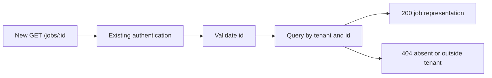

# Reviewer Walkthrough

Load this reference only when the significance gate in `SKILL.md` applies or
the user explicitly requests a walkthrough. Help a reviewer understand the
changed behaviour, its boundaries, and the decisions that need their attention.
Keep it within the PR's **Reviewer walkthrough** section by default.

## Choose A Useful View

Start with the concrete before/after outcome, then choose a compact view that
answers the main review question:

| Review question | Suitable view |
| --- | --- |
| How does a new endpoint or cross-service operation work? | Mermaid sequence or flow diagram showing the request, relevant guards, state changes, and response. |
| What changed in a decision or lifecycle? | Short pseudocode or a before/after state-flow sketch. |
| Where did responsibilities move? | Shallow call, component, or file tree with the changed boundary marked. |
| What will the user experience? | Before/after screenshots or a small UI state comparison with a brief explanation. |

Prefer Markdown and Mermaid that reviewers can read directly on GitHub. Use an
HTML artefact only when interaction or layout is essential and a simpler view
would obscure the change. Provide an accessible attachment or authorised
preview link with a static summary; a local filesystem path is not a usable PR
link. Do not publish or deploy a preview without the required authorisation.
Do not add generated review assets to the code diff unless repository conventions
or the user call for them.

## Ground It In The Implementation

- Use actual routes, components, functions, and states from the reviewed head.
  Link the few consequential code locations using verified, commit-pinned
  permalinks; if unavailable, give file and symbol references without inventing
  URLs. Distinguish new behaviour from existing dependencies.
- Include the relevant rejection/failure path or side effect when it affects
  correctness. Do not depict guarantees that the implementation does not make.
- For an endpoint, give a concise request/response example and the relevant
  permission, validation, and persistence boundaries. Include only the details
  needed to judge its contract.
- End with one to three specific review questions, tied to code or evidence:
  for example, whether tenant scoping precedes a query, or whether retries can
  repeat an external side effect. Omit questions already conclusively answered
  by routine checks.
- Separate observed results from illustrative examples and untested expectations.
  A walkthrough explains the implementation; it does not replace tests or prove
  merge readiness. Sanitise sample payloads, logs, and screenshots.
- Recheck the walkthrough and blast-radius assessment when the PR head changes.

## Endpoint Example

Illustrative only: replace every name, behaviour, and outcome with evidence
from the actual change. A small read-only endpoint still warrants this compact
orientation; it need not become a presentation.

Before: clients could list jobs but could not retrieve one job directly.
After: `GET /jobs/{id}` returns one job visible to the current tenant.

Example contract for an authenticated caller with a valid ID:
`GET /jobs/job_123` returns `200 {"id":"job_123","state":"queued"}` when the job
is visible, or `404` when absent or outside the tenant. Link the handler and
tenant-scoped query. Point reviewers towards whether the response exposes only
intended fields and whether cross-tenant access has meaningful negative coverage.

## Source

Inspired by HumanLayer's [show-me skill](https://github.com/humanlayer/skills/blob/main/plugins/show-me/skills/show-me/SKILL.md).
This workflow is self-contained: it does not install or automatically invoke
that skill. The PR significance gate controls when this guidance is used.
